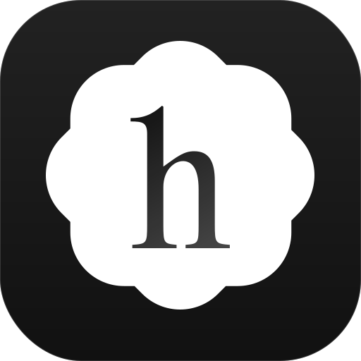
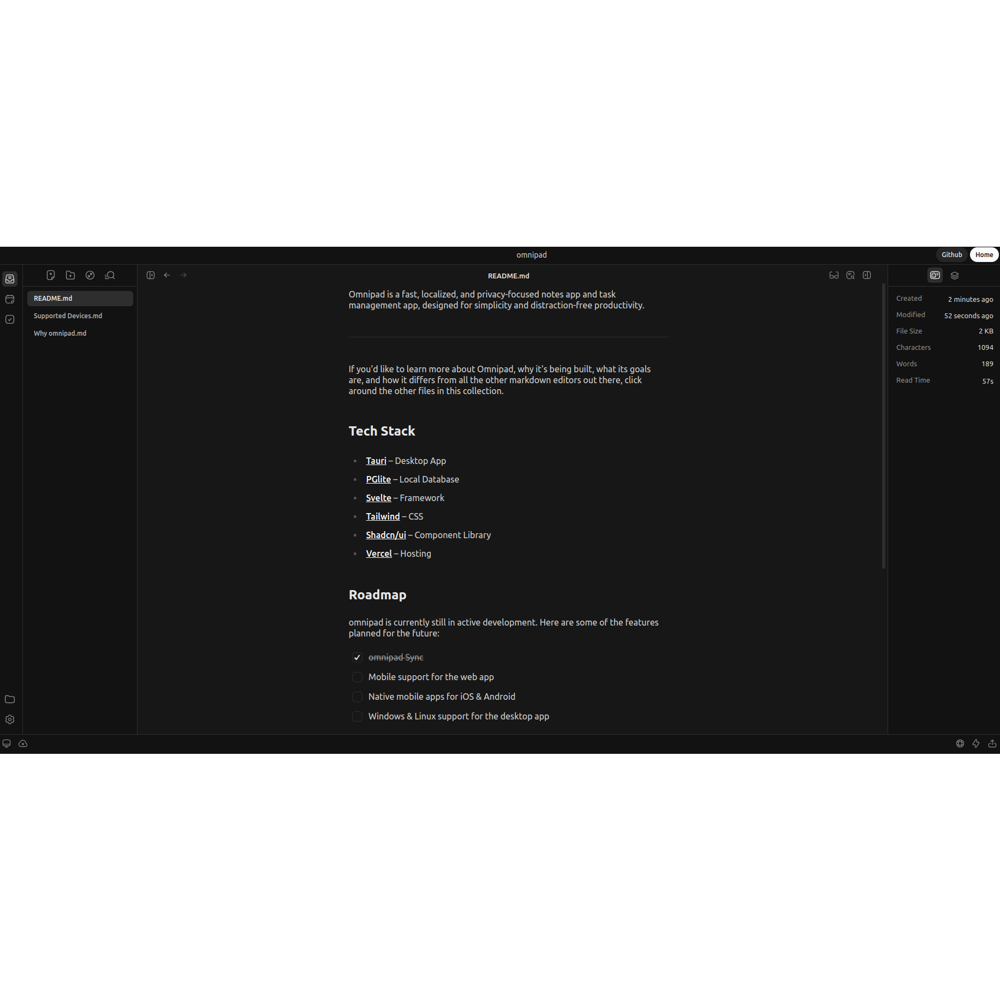

<!-- Header -->

  

  <h3 align="center">Omnipad
  </h3>
  <b>
    Your secure haven for private notes taking and task management
  </b>

<!-- TOC -->

    <a href="https://haptic.md"><strong>Learn more »</strong></a>
     
     
    <a href="https://github.com/iBz-04/omnipad/tree/main#introduction">Intro</a>
    ·
    <a href="https://github.com/iBz-04/omnipad/tree/main#tech-stack">Tech Stack</a>
    ·
    <a href="https://github.com/iBz-04/omnipad/tree/main#roadmap">To do</a>
    ·
    <a href="https://github.com/iBz-04/omnipad/tree/main#contributing">Contributing</a>
  

    <a href="https://omnipad-web.vercel.app/">
      <picture>
        <source media="(prefers-color-scheme: dark)" srcset="./.github/assets/haptic-dark.png">
        <source media="(prefers-color-scheme: light)" srcset="./.github/assets/haptic-light.png">
        
      </picture>
    </a>

## Introduction

Omnipad is a fast, localized, and privacy-focused notes app and task management app, designed for simplicity and distraction-free productivity.

If you'd like to learn more about omnipad, why it's being built, what its goals are and how it differs from all the other markdown editors out there, you can read more about it [here](https://omnipad-home.vercel.app/).

## Tech Stack

- [Tauri](https://tauri.app/) – Desktop App
- [PGlite](https://pglite.dev/) – Local Database
- [Svelte](https://kit.svelte.dev/) – Framework
- [Tailwind](https://tailwindcss.com/) – CSS
- [Shadcn/ui](https://www.shadcn-svelte.com/) – Component Library
- [Vercel](https://vercel.com/) – Hosting

## To do

Omnipad is still in under development. Here are some of the features planned for the future:

- [ ] Omni Sync - Sync your notes across devices
- [ ] Note sharing - Share single notes or entire collections via link
- [ ] Mobile support for the web app - Currently dependent on PGlite support for mobile
- [ ] Native mobile apps for iOS & Android
- [ ] Windows & Linux support for the desktop app

## Contributing

Here's how you can contribute:

- [Report a bug](https://github.com/iBz-04/omnipad/issues/new?labels=bug) you found while using Omnipad
- [Request a feature](https://github.com/iBz-04/omnipad/issues/new?labels=enhancement) that you think will be useful
- [Submit a pull request](https://github.com/iBz-04/omnipad/pulls) if you want to contribute with new features or bug fixes

## License

Omnipad is licensed under the [GNU Affero General Public License Version 3 (AGPLv3)](https://github.com/iBz-04/omnipad/blob/main/LICENSE).

---
